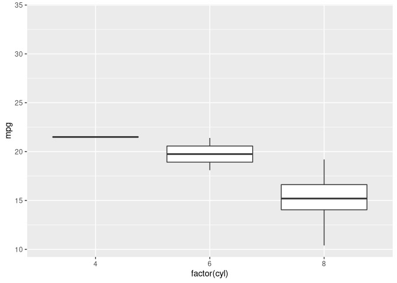

# title

``` r
library(ggplot2)
library(gganimate)
ggplot(mtcars, aes(factor(cyl), mpg)) + 
  geom_boxplot() + 
  # Here comes the gganimate code
  transition_states(
    gear,
    transition_length = 2,
    state_length = 1
  ) +
  enter_fade() + 
  exit_shrink() +
  ease_aes('sine-in-out')
```

<!-- -->
