# Peru

Datos del peru,

## Librerias

``` r
if(!require(librarian)) install.packages('librarian')
```

    ## Loading required package: librarian

``` r
librarian::shelf(tidyverse, sf, here, janitor)
```

    ## 
    ##   The 'cran_repo' argument in shelf() was not set, so it will use
    ##   cran_repo = 'https://cran.r-project.org' by default.
    ## 
    ##   To avoid this message, set the 'cran_repo' argument to a CRAN
    ##   mirror URL (see https://cran.r-project.org/mirrors.html) or set
    ##   'quiet = TRUE'.

## Todos los datos

Se hace de esta manera para ganar tiempo

``` r
tidy_tex <- \(.x){.x %>% str_to_lower() %>% str_trim()}
tidy_shp <- \(.data){
  .data %>% 
    clean_names() %>% 
    mutate(across(where(is.character), tidy_tex)) %>% 
    select(!fuente) %>% 
    rename(reg = departamen)
}
```

``` r
peru <- 
  dir(here::here("datos"), recursive = T, pattern = ".shp$", full.names = T) %>% 
  map(read_sf) %>% 
  map(tidy_shp)
```

``` r
random_plot <- \(.geo_data){
  .geo_data %>% 
    ggplot() +
    geom_sf(fill = "white", color = "black") +
    theme_void()
}
```

## Departamentos

``` r
peru[[1]] %>% 
  random_plot()
```

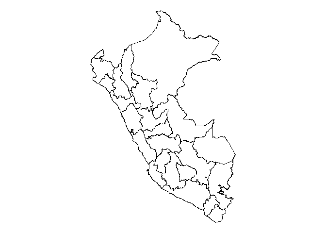<!-- -->

### Mapa para todos los departamentos

``` r
reg_p <- 
  peru[[1]] %>% 
  pull(reg) %>% 
  str_sort()
```

``` r
r1 <- reg_p[1:7]
r2 <- reg_p[8:15]
r3 <- reg_p[16:21]
r4 <- reg_p[22:25]

plot_all <- \(.geo_data, .reg){
  .reg1 <- enquo(.reg)
  p1 <- .geo_data %>% 
    filter(reg %in% !!.reg1) %>% 
    random_plot() +
    labs(title = .reg)
  print(p1)
}

for(.i in c(r1, r2, r3, r4)) {
  plot_all(peru[[1]], .i)
}
```

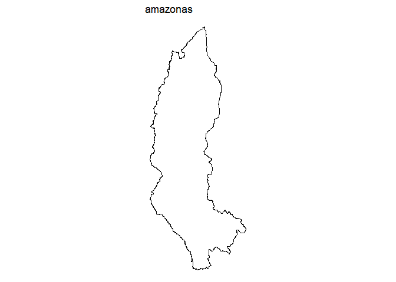<!-- -->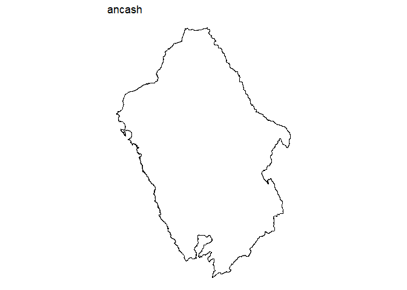<!-- -->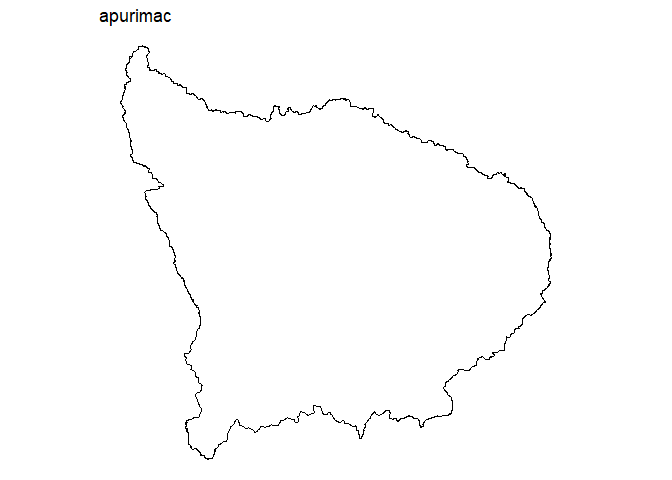<!-- -->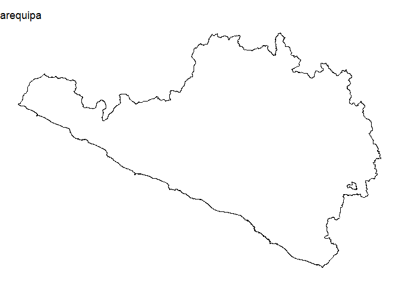<!-- -->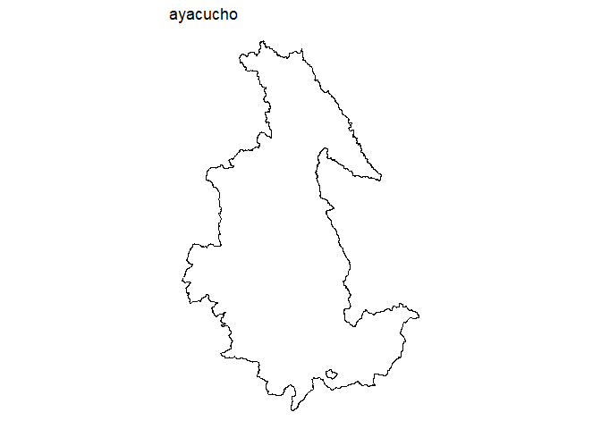<!-- -->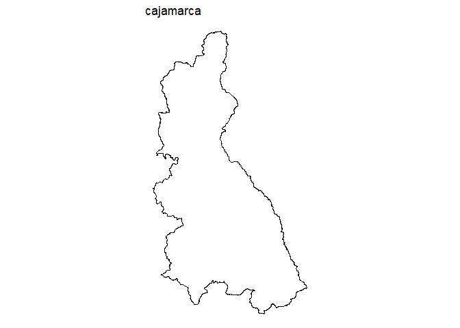<!-- -->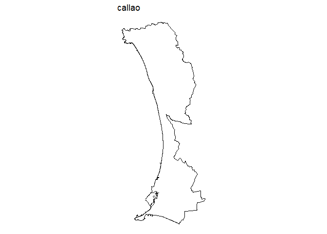<!-- -->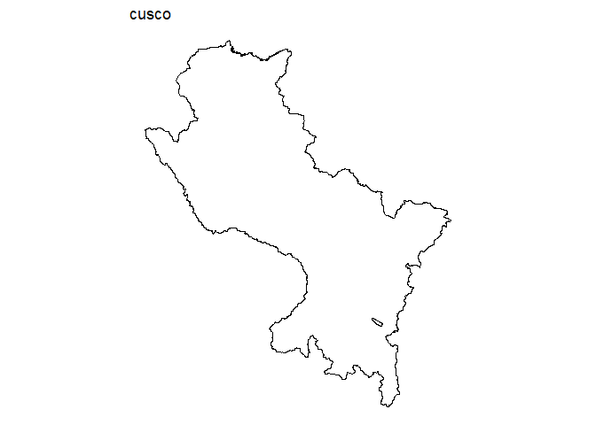<!-- -->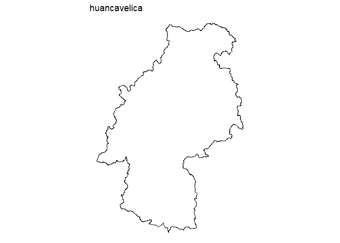<!-- -->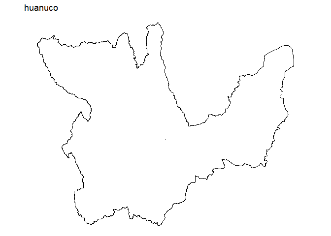<!-- -->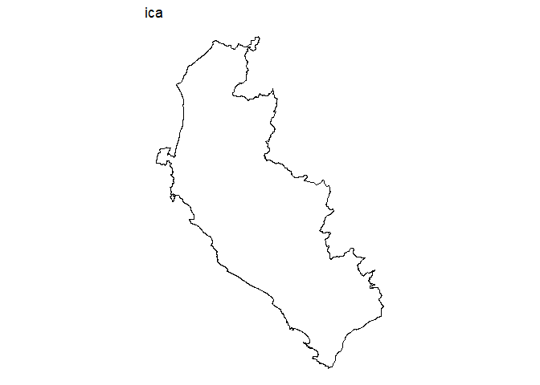<!-- -->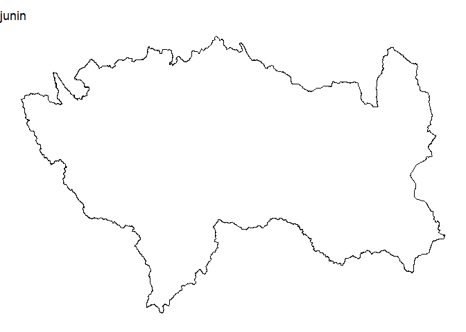<!-- -->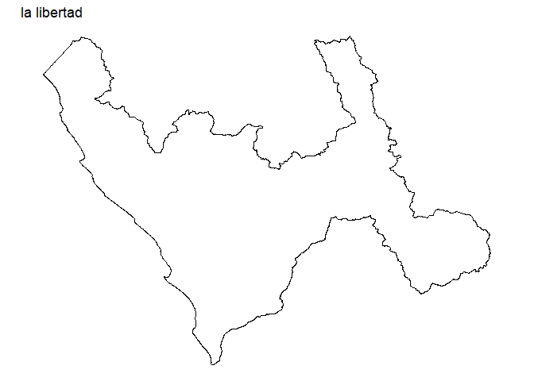<!-- -->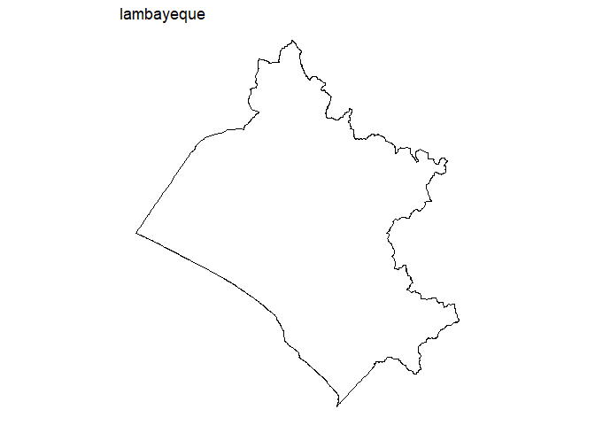<!-- -->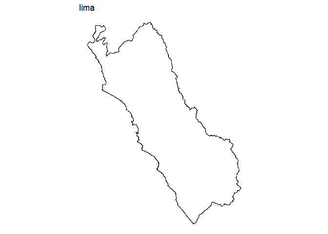<!-- -->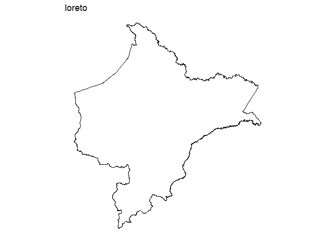<!-- -->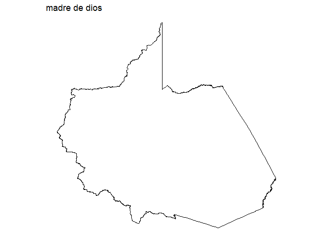<!-- -->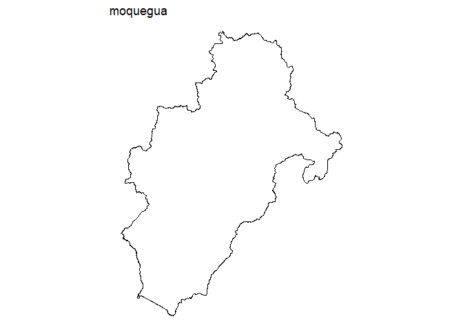<!-- --><!-- --><!-- -->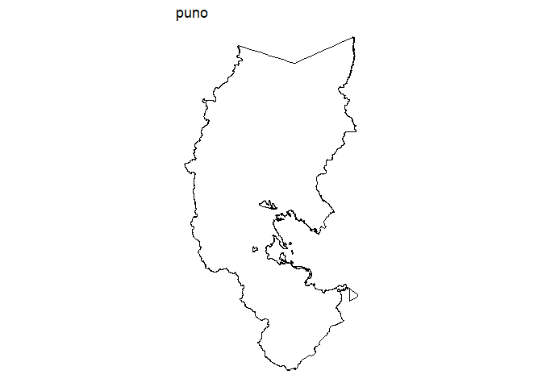<!-- -->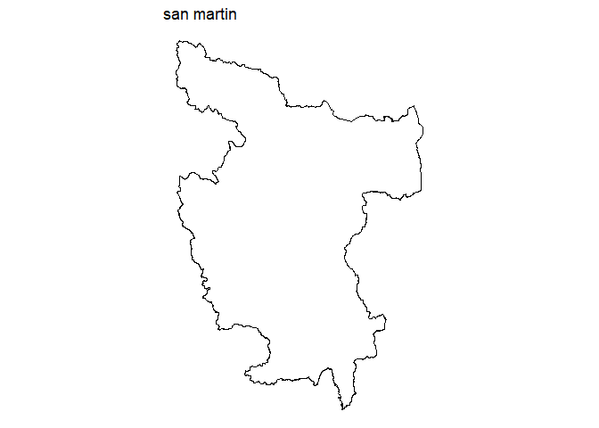<!-- -->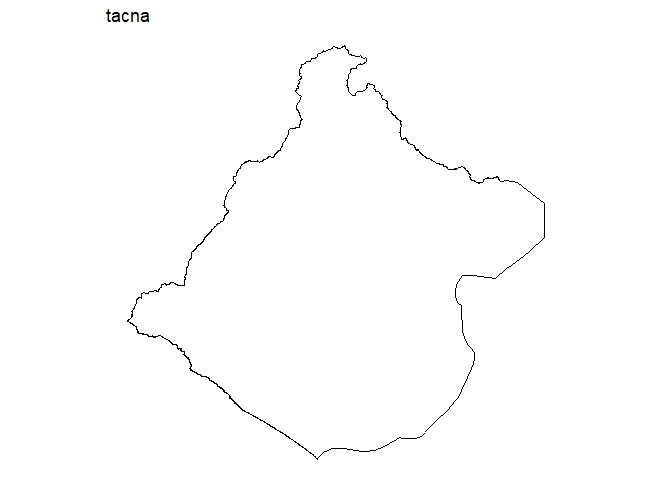<!-- -->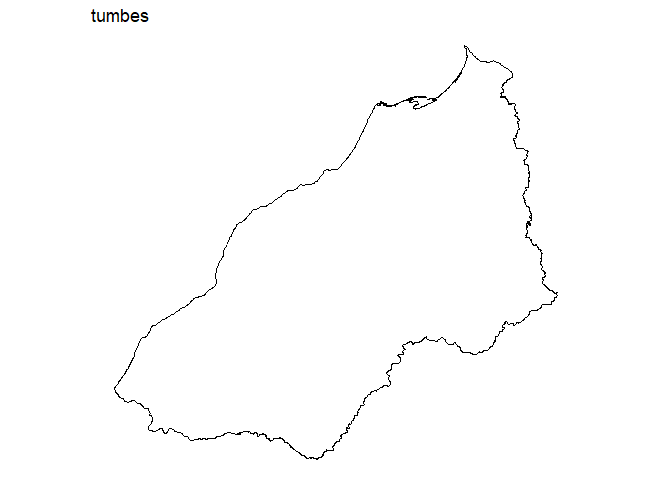<!-- -->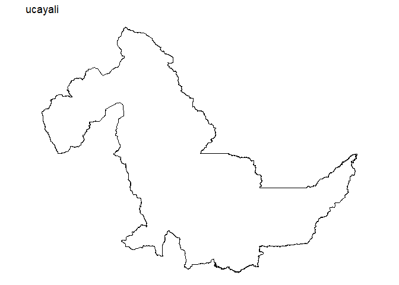<!-- -->

## Provincias

``` r
peru[[3]] %>% 
  random_plot()
```

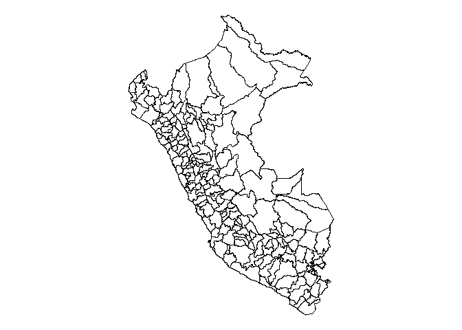<!-- -->

## Distritos

``` r
peru[[2]] %>% 
  random_plot()
```

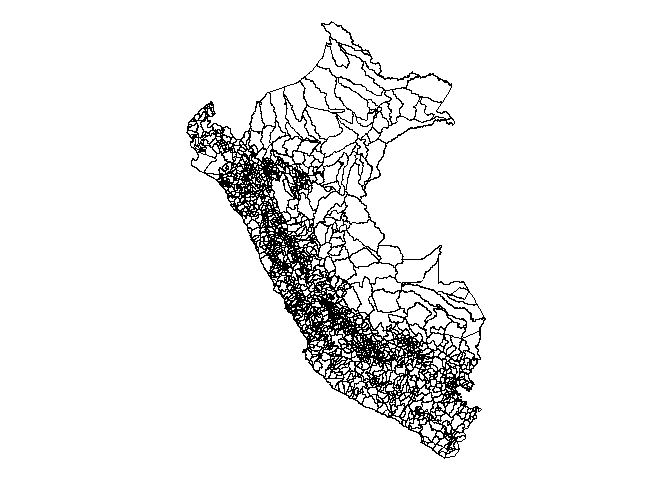<!-- -->

# Guardar los datos

``` r
peru[[1]] %>% 
  saveRDS(here::here('datos', 'rds', 'dep.rds'))
peru[[3]] %>% 
  saveRDS(here::here('datos', 'rds', 'prov.rds'))
peru[[2]] %>% 
  saveRDS(here::here('datos', 'rds', 'dist.rds'))
```
